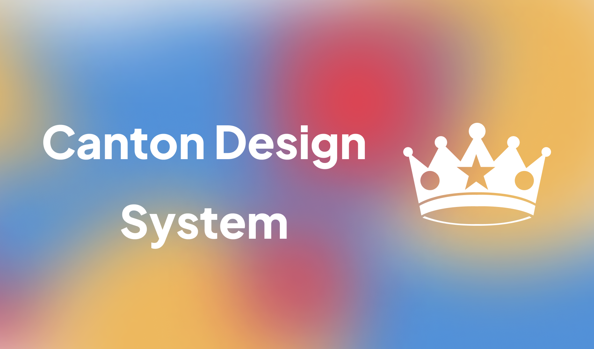
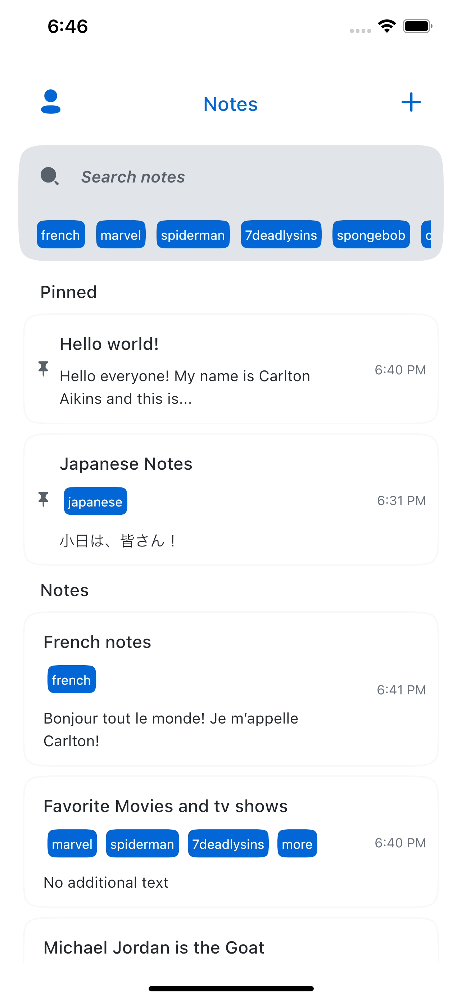
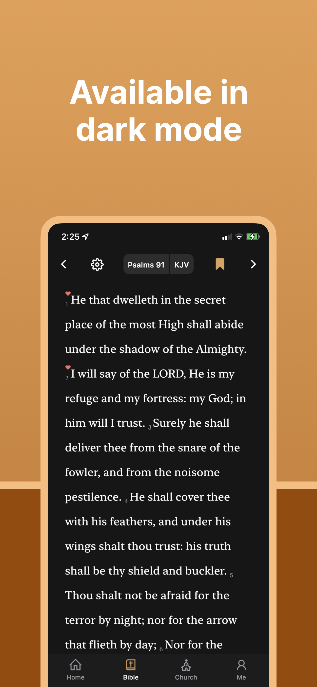

# Canton UI

Canton UI elements and resources for Flutter.

## Examples in Apps

| [Notes App](https://github.com/31carlton7/flutter_notes_app) | [News App](https://github.com/31carlton7/flutter_news_app) | [Elisha](https://github.com/31carlton7/elisha) |
| :----------------------------------------------------------: | :--------------------------------------------------------: | :--------------------------------------------: |
|                                  |                                    |                    |

<!-- <table>
  <tr>
    <td>
       </img>
    </td>
    <td>
      
  </img>
    </td>
    <td>
        
  </img>
    </td>
  </tr>
</table> -->

## Description

This includes things such as themes (colors, typography, etc.), custom methods, buttons, text-inputs, a color picker, and more. This all in attempt to limit the amount of time I spend on remaking simple tools and ui, while still customizing my screens to my flavor. Please note that this package will not be uploaded on pub.dev in the near future.

## Getting Started

To use this package and access its content, add this dependency to your pubspec.yaml

```
dependencies:
    canton_ui: <latest_version>
```

And simply import the package using this code

```
import 'package:canton_ui/canton_ui.dart';
```

BTW `package:flutter/material.dart` is already imported when using this package so no need to re-import :)

## Using

_Note:_ The package is versatile in a sense that you do not have to use all of the elements in the package. You can mix it in with Material and Cupertino elements with no problem with the exception of certain elements.

#### CantonApp

Replaces MaterialApp. Recommended that you use this over MaterialApp to get you the theming and lightmode/darkmode switching.

```
CantonApp(
    title: kAppTitle,
    primaryLightColor: CantonColors.blue // Or any other color,
    primaryLightVariantColor: CantonColors.blue[200]! // Or any other color,
    primaryDarkColor: CantonDarkColors.blue // Or any other color,
    primaryDarkVariantColor: CantonDarkColors.blue[200]! // Or any other color,
    home: YourMainAppWidget(),
)
```

#### CantonScaffold

Use this as a replacement for `Scaffold()` widget. Adds padding and other elements.

```
CantonScaffold(
    body: Column(
        children: [...]
    )
)
```

#### Colors

You can view all the colors at `lib/config/themes/(light_theme or dark_theme)/(light or dark)_color_palette.dart`

Using colors directly is discouraged and should be accessed through `Theme.of(context).colorScheme`

This is to allow the light and dark colors to be used in the correct situation (When app is in light mode or dark mode). Exceptions to this rule do apply, for instance when setting up CantonApp.

```
CantonColors.blue

CantonColors.pink[300]

CantonDarkColors.green
```

#### ViewHeader

Instead of using a navbar, CantonUI uses a ViewHeader, in which you can customize the leading and action buttons

```
ViewHeaderOne(
    title: ...,
    button: ..., // Placed on right side
)


ViewHeaderTwo(
    title: ...,
    backButton: ...,
    isBackButtonClear: ...,
    buttonOne: ...,
    buttonTwo: ...,
)
```

#### Buttons

CantonUI has a lot of different buttons to choose from.

```
ActionButton()

BackButton()

HeaderButton() // Commonly used in ViewHeaders

NullButton() // Great spacer widget

PrimaryButton() // Default button, great for all use cases, highly customizeable
```

#### TextInput

CantonUI offers a standard text input and a tag text input field (Used in the note taking app). Both inputs are highly customizeable and it'll look good right out of the box.

```
CantonTextInput() // obscureText is required if isTextFormField is true

CantonTagTextInput()
```

#### Loading

Default Loading Spinner

```
Loading()
```

#### RefreshList

If you're making an app in which pull to refresh is needed (like a news app or an app that needs to call an API) then this widget has you covered.

```
RefreshList(
    child: ...
)
```

#### Responsive

If you need to create a UI that's needs to compensate for different screen sizes, then you can use the Responsive widget to take care of it.

_Note:_ mobile and tablet are required.

```
Responsive(
    desktop: YourDesktopWidget() // Screens larger than 1100px width,
    tablet: YourTabletWidget() // Screens between 650 - 1149 px width,
    mobile: YourMobileWidget() // Screens between 0 - 649 px width,
)
```

## All Features

- _Null Safe:_ This package supports null safety.
- _Color system:_ Credits to the Primer Color system, as this is a modified version of theirs.
- _Typography system:_ Credits to the Primer typography system.
- _Buttons:_ Resizable primary button, small/header button and back button with all necessary customizations.
- _Text Inputs:_ Custom text field, text form fields, and a tag text field.
- _Borders:_ border customization.
- _Loading icon:_ Loading icon/widget.
- _Animations(WIP):_ Fluid animations to give a playful but professional feel.
- _Custom Methods:_ Custom methods with ease of use.
- _Icon System:_ Icon system that utilizes Iconly icons, Feather Icons and Cupertino Icons.
- _Custom Fonts:_ Both serif and sans serif typefaces consisting of Inter UI and Times New Roman.
- _Light theme:_ Clean light theme.
- _Dark Theme:_ Clean dark theme with all elements modified.
- _Dynamic Device Theming_: Accustoms to light mode and dark mode based on current device.

## Dependencies

```
flutter_riverpod: ^0.14.0+3
flutter_slidable: ^0.6.0
flutter_feather_icons: ^2.0.0+1
flutter_spinkit: ^5.0.0
flutter_svg: ^0.22.0
page_transition: ^2.0.2
liquid_pull_to_refresh: ^3.0.0
cupertino_icons: ^1.0.3
```

## Figma

[Link](https://www.figma.com/file/2CqQmmBKSA8f0fvrzsHNO7/Canton-Design-System?node-id=405%3A515) to design system on figma to view UI elements

## Socials

If you have any questions, you can reach me here:

- Instagram: [@31Carlton7](https://www.instagram.com/31carlton7/)
- Email: carltonaikins7@gmail.com
